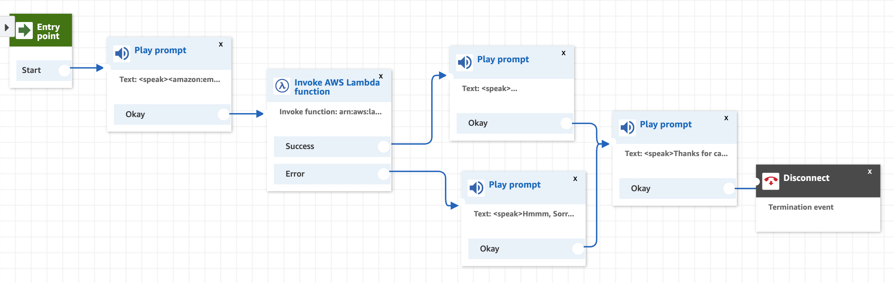
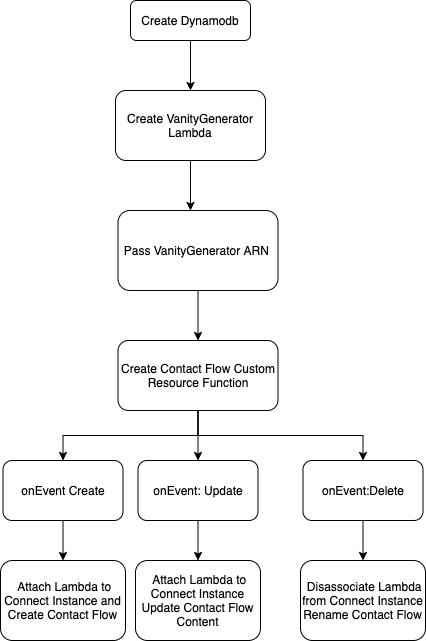

## Approach
 **Record your reasons for implementing the solution the way you did, struggles you faced and problems you overcame.**
The CDK has custom functions that are actually implemented as custom cloudfront resources so using the CDK seem to be the "well paved" path when dealing with custom constructs/resources. 
The real challenge was with the aws connect API which seem to be new! (just released 3months ago). 
1. One major issue was an error on the `AssociateLambdaFunction` call, i spent a great deal of time trying to figure out why it was failing with the error `Lambda Function not found` while in fact the function was already created in the same region as the connect instance. After an extensive process of elimination i dicovered that ineeded to add the `Lambda:AddPermisssion` to grant lambda permissions to attach my vanity function to connect instance. Wow, would it have been helpful if the CF error was clear about this. 
2. 2.Another small issue was trying to use the Contact Flow json export(beta) from the aws console to `createContactFlow` via the API. Well, it turns out there is a Contact Flow Language! had to check different language documentations for the same function to discover that calling the `describeContactFlow` gets you the right json.
3. This one i am still yet to figure out. During the stack destroy process, an attempt to disassociate the lambda function from the connect instance fails because the function gets deleted before my custom resource gets called to disassociate. I think setting the delete order on Cloudfront could resolve this.

 **What shortcuts did you take that would be a bad practice in production?**
   Not much,while i have some tests for the lambda functions, i may have sacrificed a robust/comprehensive testing setup which is vital for continuous development.

**What would you have done with more time?**
Comprehensive tests on the custom construct and lambda functions. Still need to figure out a issue #3 above. 
i would attempt the super bonus web frontend. My idea was a create a websocket via APIGateway which clients can listen to dynamodb events on the frontend.
This could be deployed via the CDK too with a custom resource which updates the frontend code on s3 with the deployed API endpoint.
With more time i would have spent some time on custom vanity function. ATM i am using a python library (`vanitynumber`) to achieve this. 

**What other considerations would you make before making our toy app into something that would be ready for high volumes of traffic, potential attacks**
1. There could be potential exposure and abuse of deployment resources if arn permissions are not configured right. Eg. when creating lambda functions and dynamo its always important to restrict to which resources are allowed to use/invoke these services. 
2. As far as high traffic volume goes, a potential issue (very unlikely) could be the concurrency limit of 1000 on lambda functions however you'll need to have an insane amount of traffic to hit this limit so this could be countered as an edge case.
3. You could also deploy the stack at multiple locations for global call centers to deal with call latency, if all data need to be synced into a central dynamodb then we could leverage dynamodb global tables to sync changes across multi-regional deployments

### Diagrams

#### Contact Flow

#### CloudFormation Workflow
 
